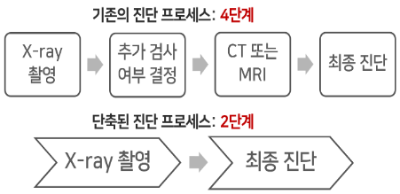

폐질환 의심 응급환자의 진단과정 단축을 위한 AI 흉부 X-ray 진단보조서비스
=============

```
진단 속도 12초로 응급환자의 x-ray 이미지를 진단할 수 있는 정확도 97.1, auc 84.12의 서비스 제작
x-ray 이미지를 업로드하면 상위 3개의 질병을 확률값과 함께 표시
빨간 박스로 질병으로 의심되는 영역을 표시
```


## 주제 구체화 과정
#### `1) 의료 현장 리서치`
- 응급실을 찾는 환자의 절반 이상(56%)이 엑스레이 촬영을 받고 있다. 
- 그 중 흉부외과는 x-ray 촬영률이 90%로 가장 높았다. 
- 흉부손상은 외상으로 인한 사망의 20~25%를 차지할 정도로 적정시기의 적절한 치료가 매우 중요하다. 
- x-ray 진단에 소요되는 시간은 3371초, 약 1시간으로 골든타임이 중요한 응급환자에게는 긴 시간일 것이다. 
- 응급실에서의 대기시간에 대한 만족도 조사에 의하면 40점대로 낮다는 것도 확인할 수 있었다.
- 영상의학과 전문의 인터뷰 진행
    - 유방암 석회 detection 하는 '캐드' 활발히 사용
    - 유용하고 정확한 프로그램이라면 보조기구로써 사용할 의향 있음
    - ‘루닛’, ‘뷰노’ 등의 시제품 🡪 비용 문제 발생

#### `2) 의료 현장 문제점`
- 진단 시간이 많이 걸리는 이유는 x-ray 촬영을 한 후 그 결과를 바탕으로 추가 검사 여부를 결정하게 되며 이 후 ct나 mri 등의 추가 검사를 마친 후에 최종진단에 이르게 되는 4단계의 프로세스로 진행되기 때문이었다. 
- 각 프로세스별 대기시간까지 고려한다면 분명 적지 않은 시간일 것이다.

#### `3) 프로젝트 목표`
- 해결방안 : 응급환경의 시간과 비용의 절감을 위해 추가 검사를 생략한, x-ray 촬영만으로 최종진단에 이르는 단축된 진단 프로세스 개발

- 타겟시장 : 응급실, 구급차 보유 병원
- 고객의 Needs : 적은 데이터로 빠른 시간에 x-ray 사진을 진단&관리할 프로그램 필요
- 기대사항 : 환자의 생존율을 높이고, 이에 소요되는 시간과 비용을 줄이는 것


## Classification
#### `1) 고려한 점`
- 13개의 질병을 분류할 수 있는 모델 생성
- 각 질병에 대한 정확도 출력
- 짧은 시간 안에 높은 정확도를 내야함
- 웹에 모델을 사용하기 위해 가중치 파일 저장

#### `2) 데이터`
- 최대한 많은 양의 데이터를 위해 며칠간 서칭
- 신뢰성 있고 전문가에 의해 라벨링이 되어 있는 이미지 데이터 발견
- 데이터 수집 : https://www.kaggle.com/nih-chest-xrays/data
- bounding box 가 있는 데이터를 보고 추후 Detection도 결정

#### `2) 기술 선택 과정`
- 초기 : colab gpu 학습 진행 (1epoch 당 몇시간이 걸릴 정도로 오래 걸림/중간에 꺼짐)
- 이후 : Ubuntu 서버 대여 -> 한 모델 당 2-3일에 학습 가능

- tensorflow에서 제공하는 6가지 CNN model 실험


- imagenet의 pre-trained weight 학습
- test AUC가 가장 높았던 efficientnet model을 fine-tuning하여 사용

#### `3) 정확도에 대한 이슈들`
- 극초기 : 정확도가 너무 낮게 나옴 -> binary accuracy가 아닌 accuracy 를 출력해서 정확도가 낮게 나옴 -> 수정
- 초기 : imagenet pretrained, model에 최적화되게 image size 변경, layer 변경
- 중간 : validation과 test dataset의 accuracy 차이가 너무 큼 -> validation dataset으로 train dataset을 사용하고 있었음 -> 수정
    - 해당 이유를 알지 못해 다른 시행착오 겪음
    - 기존에 정해져있던 데이터 비율 조정 : Train, Valid, Test 데이터 비율 0.64:0.16:0.2 -> 0.6:0.2:0.2
    - Train, Test split 함수의 stratify 옵션을 사용하여 데이터의 질병 분포 유지 (MultilabelStratifiedKFold 이용)
    - 같은 환자의 데이터가Train, Valid, Test 데이터 에 모두 나누어 들어가 있었음
    - -> 같은 환자의 데이터라면 하나만 남기고 삭제
    - -> 모든 데이터셋에 다른 환자가 들어가도록 설정
- get_roc_curve를 이용하여 AUROC 값 출력
        

## Detection
#### `1) 고려한 점`
- 13개의 질병 위치를 검출할 수 있는 weight 파일 생성
- 의심 질병이 여러 개라면 여러 box 출력

#### `2) 데이터`
- 기존 데이터 사용

#### `2) 기술 선택 과정`
- yolov5 선택

#### `3) 데이터에 대한 이슈들`
- 기존에 갖고 있던 데이터의 개수 부족
- 추가 데이터 서치
- 기존 데이터의 질병과 같은 데이터들만 bounding box 등을 형식에 맞게 정제
- 추가 학습 진행


## 백엔드/프론트엔드
#### `1) 고려한 점`
- 환자 관리 : 환자 등록 및 리스팅 가능
- 환자 진단
    - 로컬에서 환자 x-ray 이미지 업로드
    - 학습한 가중치를 이용해 진단 진행
    - TOP3 질병 + 각 질병의 확률값 출력
    - 질병 감염 의심 영역 표시
    - 진단 히스토리 열람 및 삭제 가능

#### `2) 기술 선택 과정`
- 언어 선택
    - 딥러닝 기술 사용 -> Tensorflow 필요 -> Python에 최우선으로 맞춰 개발됨 -> __딥러닝 개발 : python 언어 결정__
    - 딥러닝 코드와의 연결 필요 -> __백엔드/프론트엔드 : python 언어 결정__

- 프레임워크 선택
    - python 언어를 사용할 Flask or Django 고민
    - Flask 로 개발 시도 : https://saeyoun.tistory.com/2 
    - 보안, 인증 등의 기능 직접 구현 복잡함 & Flask를 이용한 많은 기능이 구현된 프로젝트를 찾기 어려움
    - Django로 Airbnb 클론코딩이 가능하다는 것을 발견 -> 로그인/이미지업로드/리스팅/상세정보 관리 등 필요한 기능 겹침 -> 토이프로젝트 진행
    - __Django로 개발 결정__ : https://saeyoun.tistory.com/3

#### `3) 백엔드와 딥러닝 연동하기`
- Classification : 백엔드에서 해당 모델의 backbone을 직접 만들고 학습된 가중치를 부여하는 방식으로 진행
  - Django의 환자 app 에서 'diagnosis.py' 생성
  - image load 함수를 통해 이미지를 로드하고 생성 모델로 질병 예측
  - 상위 3개의 질병과 확률값 저장 및 반환
- Detection : 백엔드에서 yolov5 모델을 만들고 학습된 가중치를 부여하는 방식으로 진행
  - 이미 로드된 이미지로 'detect.py' 실행시켜 uploads/patient_images/ 경로에 detect 된 이미지 저장
  - 'form.py'에서 새로운 patient 객체에 x-ray 이미지, 질병진단결과, 질병영역검출결과 저장

#### `3) 결과`


## 최종 프로그램 구조


## 논문
###### 폐질환 의심 응급환자의 진단 과정 단축을 위한 AI기반 X-ray진단 시스템
###### https://drive.google.com/file/d/1FnQGBRWvJ70iH2Rut0L7hjO-4Bt15vpc/view?usp=sharing
